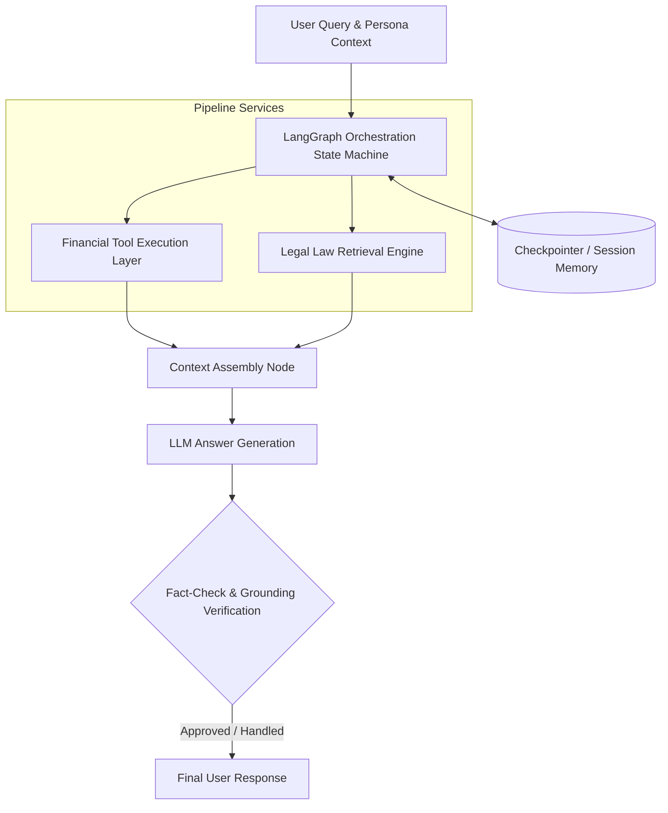
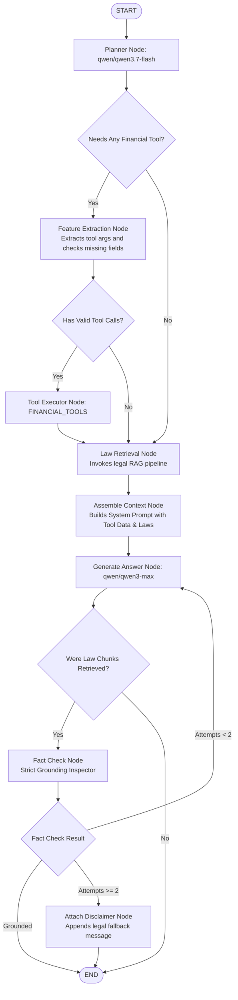
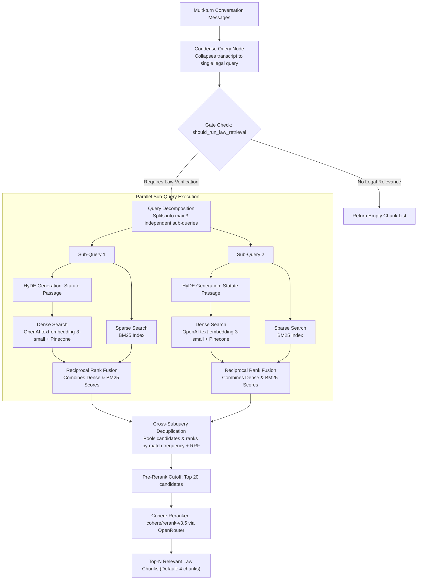

# 🤖 Agentic Retrieval-Augmented Pipeline for Personalized Financial Advisory with Behavioral Personalization and Grounded Legal Retrieval

> A stateful, persona-adaptive financial advisory system featuring **HyDE query translation**, **GMM psychometric clustering**, **hybrid legal retrieval (Dense + BM25)**, **Cohere reranking**, and automated **fact-checking loops** built with FastAPI, LangGraph, and Streamlit.

---

## 💡 Key Architectural Highlights

- **🧠 GMM Behavioral Profiling**: Classifies users into 4 latent financial personas (e.g., *Anxious Saver*, *Risk-Tolerant*) via psychometric intake to dynamically adapt response tone and risk framing.
- **🔄 HyDE Query Translation**: Decomposes legal queries into sub-queries and generates synthetic legal passages (Hypothetical Document Embeddings) to improve semantic matching.
- **🔀 Hybrid Retrieval & RRF**: Parallel dense vector search (`text-embedding-3-small`) and sparse keyword search (`BM25`), fused using **Reciprocal Rank Fusion (RRF)** and rescored via **Cohere Reranker (`rerank-v3.5`)**.
- **⚡ Financial Tool Layer**: Deterministic execution nodes for dynamic parameters (Amortization Calculator, Debt-to-Income / Credit Scoring, and Macroeconomic APIs).
- **🛡️ Fact-Check Loop**: Iterative LangGraph verification node that checks claim grounding against statutory chunks, automatically retrying generation or attaching disclaimers.
- **🔐 Stateful & Secure**: Multi-tenant thread isolation with async PostgreSQL + `pgvector` storage, JWT auth, and LangGraph Postgres checkpointers.

---

## 💻 Tech Stack

- **Orchestration**: LangGraph, LangChain, Pydantic v2
- **Models**: `qwen/qwen3.7-flash` (Planner/HyDE/Fact-Check), `qwen/qwen3-max` (Answer Generation)
- **Retrieval Engine**: Pinecone (Dense), BM25 (Sparse), Cohere Rerank v3.5
- **Backend & Database**: FastAPI, Async SQLAlchemy 2.0, PostgreSQL + `pgvector`
- **Frontend**: Streamlit (Streaming UI)

--
## 📦 Quick Start (Docker Compose)

1. Copy environment template and edit values:
   ```bash
   cp env.example .env
   ```
2. Start the full stack:
   ```bash
   docker compose up --build
   ```

Services:
- Backend API: `http://localhost:8000/api/v1`
- API Docs: `http://localhost:8000/api/v1/docs`
- Frontend UI: `http://localhost:8501`

🛠️ Local Development
1. Backend (FastAPI)
Bash
cd backend
python -m venv .venv
source .venv/bin/activate  # Windows: .venv\Scripts\activate
pip install -r requirements.txt
uvicorn app.main:app --reload --port 8000

2. Frontend (Streamlit)
Bash
cd frontend
python -m venv .venv
source .venv/bin/activate  # Windows: .venv\Scripts\activate
pip install -r requirements.txt
streamlit run gui/main.py

### 🧩 Pipeline Architecture
### 1. Abstract System Lifecycle



### 2. LangGraph Execution Workflow


### 3. Query Translation & Retrieval Pipeline


📝 License
Licensed under the MIT License.
